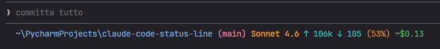

# Claude Code Status Line

A status line hook for [Claude Code](https://claude.ai/code) that shows working directory, git branch, model name, token counts, context usage, and session cost — updated after every turn.

Two scripts are provided: one for Windows (PowerShell) and one for Linux/macOS (Bash).

## Preview




| Color  | Field |
|--------|-------|
| Blue   | Working directory (home shortened to `~`) |
| Magenta | Git branch |
| Orange | Model name |
| Cyan   | Token counts: ↑ tokens in context window · ↓ last-response output tokens |
| Yellow | Context window usage % |
| Green  | Cumulative session cost |

<!-- TODO: add screenshots here -->
<!-- Suggested shots:
     1. Full status line with all fields visible
     2. Status line mid-session with high context usage
     3. Example with branch and cost visible
-->

## Requirements

| Platform | Requirement |
|----------|-------------|
| Windows  | PowerShell 5.1+; PowerShell 7+ (`pwsh`) recommended |
| Linux/macOS | Bash 3.2+; `jq` **or** `python3` for JSON parsing |

## Installation

### Windows

```powershell
.\install.ps1
```

Restart Claude Code. On first launch you may be prompted to trust the status line command.

### Linux / macOS

```bash
bash install.sh
```

Restart Claude Code. On first launch you may be prompted to trust the status line command.

---

Both installers:
1. Copy the script to `~/.claude/`
2. Write the `statusLine` key in `~/.claude/settings.json` (non-destructive — all existing settings are preserved)

### Manual installation

If you prefer to wire things up by hand, copy the appropriate script to `~/.claude/` and add this to `~/.claude/settings.json`:

**Windows**
```json
{
  "statusLine": {
    "type": "command",
    "command": "pwsh -NoProfile -NonInteractive -File \"C:\\Users\\<you>\\.claude\\statusline-command.ps1\""
  }
}
```

**Linux / macOS**
```json
{
  "statusLine": {
    "type": "command",
    "command": "bash \"/home/<you>/.claude/statusline-command.sh\""
  }
}
```

## Configuration

Each script has a `Configuration` block at the top. No other part of the script needs to be touched for common customisations.

### Choose which fields to show and their order

Edit `STATUSLINE_TEMPLATE` (Bash) or `$STATUSLINE_TEMPLATE` (PowerShell):

```bash
# Bash — show only branch, model, and cost; no tokens
STATUSLINE_TEMPLATE=("cwd" "branch" "model" "cost")
```

```powershell
# PowerShell — move cost before tokens
$STATUSLINE_TEMPLATE = @("cwd", "branch", "model", "cost", "tokens")
```

Available fields: `cwd` · `branch` · `model` · `tokens` · `cost`

### Change the separator

```bash
STATUSLINE_SEPARATOR=" | "   # Bash
```
```powershell
$STATUSLINE_SEPARATOR = " | "  # PowerShell
```

### Replace Unicode symbols with ASCII

Some terminals do not render `↓ ↑`. Swap them for ASCII alternatives:

```bash
# Bash
SYM_TOKENS_IN="in:"
SYM_TOKENS_OUT="out:"
SYM_COST="$"
```

```powershell
# PowerShell
$SYM_TOKENS_IN  = "in:"
$SYM_TOKENS_OUT = "out:"
$SYM_COST       = "$"
```

## How it works

Claude Code invokes the configured `statusLine` command at the end of every turn, passing a JSON payload on stdin. The script reads the payload, formats the fields, and writes an ANSI-coloured string to stdout. Claude Code renders that string in the terminal status bar.

### Token semantics

| Field | Meaning |
|-------|---------|
| `↑` (input) | Tokens **currently in the context window** — input + cache creation + cache reads. Not a cumulative session total. |
| `↓` (output) | Output tokens from the **last response only**. Not cumulative. |
| `(%)` | Context window usage, calculated from input tokens only. |

### Cost

The session cost shown is `cost.total_cost_usd` as reported by Claude Code — accurate and cumulative. If that field is absent, a local pricing table is used as a rough fallback (it may overestimate because it applies the full input price to cache-read tokens).

## Updating

After editing `statusline-command.ps1` or `statusline-command.sh`, re-run the installer to deploy the updated script to `~/.claude/`.
